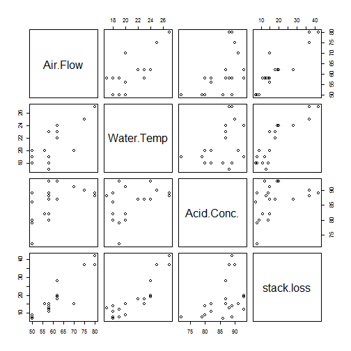

Course Project
========================================================
author: Bryan M. Aguiar
date: 24 Jan 2015
transition:rotate


Project Overview
========================================================

- Purpose of App
- Example Input
- Example Outputs
- Conclusion

App Purpose
===

Demonstrate ability to use Shiny to develop an App that:

-Takes some form of input (widget: textbox, radio button, checkbox, ...)

-Performs some operation on the ui input in sever.R

-Provides some reactive output displayed as a result of server calculations


Example Input Screen
===


The user selects a datset from the drop down box and clicks the 'Update View' button


Example Outputs: 5 Descriptive Statistics
===

This app returns common descriptive statistics for the selected dataset:


```r
library(psych)
describe(women)
```

```
       vars  n   mean    sd median trimmed   mad min max range skew
height    1 15  65.00  4.47     65   65.00  5.93  58  72    14 0.00
weight    2 15 136.73 15.50    135  136.31 17.79 115 164    49 0.23
       kurtosis   se
height    -1.44 1.15
weight    -1.34 4.00
```


Example Outputs: 5 Number Summary
===

This app returns the 5 number summary for the selected dataset:


```r
summary(women)
```

```
     height         weight     
 Min.   :58.0   Min.   :115.0  
 1st Qu.:61.5   1st Qu.:124.5  
 Median :65.0   Median :135.0  
 Mean   :65.0   Mean   :136.7  
 3rd Qu.:68.5   3rd Qu.:148.0  
 Max.   :72.0   Max.   :164.0  
```

Example Outputs: List dataset
===

This app returns a list from the selected dataset (Limited to 5 lines in this example):


```
  height weight
1     58    115
2     59    117
3     60    120
4     61    123
5     62    126
```

Example Outputs: Plot
===

This app returns an appropriate plot from the selected dataset:

 

Conclusion
===

- Purpose of App
- Example Insput
- Example Outputs
- Conclusion
