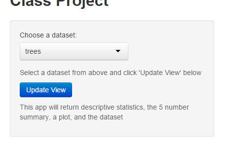
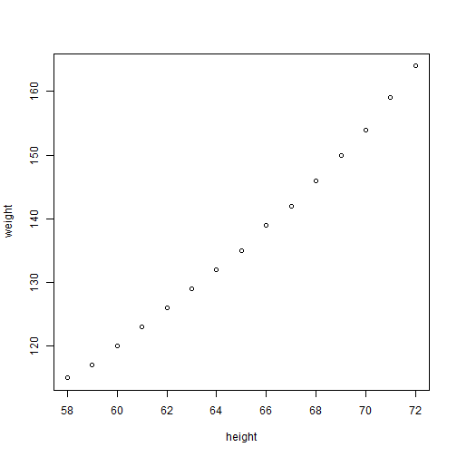

Course Project
========================================================
author: Bryan M. Aguiar
date: 24 Jan 2015
transition:rotate


App Purpose
===

Demonstrate ability to use Shiny to develop an App that:

-Takes some form of input (widget: textbox, radio button, checkbox, ...)

-Performs some operation on the ui input in sever.R

-Provides some reactive output displayed as a result of server calculations


Example Input Screen
===


The user selects a datset from the drop down box and clicks the 'Update View' button


Example Outputs: 5 Descriptive Statistics
===

This app returns common descriptive statistics for the selected dataset:


```r
library(psych)
describe(stackloss)
```

```
           vars  n  mean    sd median trimmed  mad min max range  skew
Air.Flow      1 21 60.43  9.17     58   59.35 5.93  50  80    30  0.81
Water.Temp    2 21 21.10  3.16     20   20.82 2.97  17  27    10  0.47
Acid.Conc.    3 21 86.29  5.36     87   86.76 4.45  72  93    21 -0.87
stack.loss    4 21 17.52 10.17     15   16.12 5.93   7  42    35  1.16
           kurtosis   se
Air.Flow      -0.26 2.00
Water.Temp    -1.23 0.69
Acid.Conc.     0.19 1.17
stack.loss     0.13 2.22
```


Example Outputs: 5 Number Summary
===

This app returns the 5 number summary for the selected dataset:


```r
summary(stackloss)
```

```
    Air.Flow       Water.Temp     Acid.Conc.      stack.loss   
 Min.   :50.00   Min.   :17.0   Min.   :72.00   Min.   : 7.00  
 1st Qu.:56.00   1st Qu.:18.0   1st Qu.:82.00   1st Qu.:11.00  
 Median :58.00   Median :20.0   Median :87.00   Median :15.00  
 Mean   :60.43   Mean   :21.1   Mean   :86.29   Mean   :17.52  
 3rd Qu.:62.00   3rd Qu.:24.0   3rd Qu.:89.00   3rd Qu.:19.00  
 Max.   :80.00   Max.   :27.0   Max.   :93.00   Max.   :42.00  
```


Example Outputs: Plot
===

This app returns an appropriate plot from the selected dataset:


```r
plot(stackloss)
```

 
