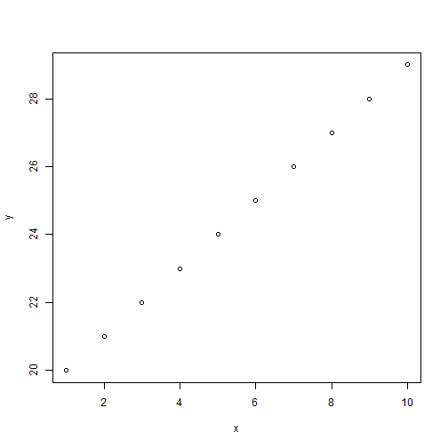

First Presentation
===
author: Dr. B
date: 16 Jan 2015

transition:rotate

First Slide
===

For more details on authoring R presentations click the
**Help** button on the toolbar.

- Bullet 1
- Bullet 2
- Bullet 3


Slide With Code
===


```r
summary(cars)
```

```
     speed           dist       
 Min.   : 4.0   Min.   :  2.00  
 1st Qu.:12.0   1st Qu.: 26.00  
 Median :15.0   Median : 36.00  
 Mean   :15.4   Mean   : 42.98  
 3rd Qu.:19.0   3rd Qu.: 56.00  
 Max.   :25.0   Max.   :120.00  
```

Slide With Plot
========================================================

 

Slide with GoogleVis
===


```
<!-- GeoMap generated in R 3.1.2 by googleVis 0.5.7 package -->
<!-- Fri Jan 16 14:29:22 2015 -->


<!-- jsHeader -->
<script type="text/javascript">
 
// jsData 
function gvisDataGeoMapID47cc12d5353b () {
var data = new google.visualization.DataTable();
var datajson =
[
 [
 "Argentina",
2.57 
],
[
 "Australia",
4.81 
],
[
 "Brazil",
5.86 
],
[
 "Britain",
4.93 
],
[
 "Canada",
5.25 
],
[
 "Chile",
3.72 
],
[
 "China",
2.73 
],
[
 "Colombia",
4.65 
],
[
 "Costa Rica",
4 
],
[
 "Czech Republic",
3.46 
],
[
 "Denmark",
5.15 
],
[
 "Egypt",
2.37 
],
[
 "Euro area",
4.95 
],
[
 "Hong Kong",
2.43 
],
[
 "Hungary",
3.77 
],
[
 "India",
1.75 
],
[
 "Indonesia",
2.43 
],
[
 "Israel",
5.13 
],
[
 "Japan",
3.64 
],
[
 "Lithuania",
3.49 
],
[
 "Malaysia",
2.41 
],
[
 "Mexico",
3.25 
],
[
 "New Zealand",
4.94 
],
[
 "Norway",
7.76 
],
[
 "Pakistan",
3.04 
],
[
 "Peru",
3.59 
],
[
 "Philippines",
3.7 
],
[
 "Poland",
3 
],
[
 "Russia",
2.55 
],
[
 "Saudi Arabia",
2.93 
],
[
 "Singapore",
3.8 
],
[
 "South Africa",
2.33 
],
[
 "South Korea",
4 
],
[
 "Sri Lanka",
2.69 
],
[
 "Sweden",
5.95 
],
[
 "Switzerland",
6.83 
],
[
 "Taiwan",
2.63 
],
[
 "Thailand",
3.12 
],
[
 "Turkey",
4.42 
],
[
 "UAE",
3.54 
],
[
 "Ukraine",
1.63 
],
[
 "United States",
4.8 
],
[
 "Uruguay",
4.92 
],
[
 "Venezuela",
6.82 
],
[
 "Vietnam",
2.83 
],
[
 "Austria",
4.56 
],
[
 "Belgium",
4.98 
],
[
 "Estonia",
3.9 
],
[
 "Finland",
5.52 
],
[
 "France",
5.25 
],
[
 "Germany",
4.94 
],
[
 "Greece",
4.11 
],
[
 "Ireland",
4.7 
],
[
 "Italy",
5.18 
],
[
 "Netherlands",
4.64 
],
[
 "Portugal",
4.04 
],
[
 "Spain",
4.91 
] 
];
data.addColumn('string','Country');
data.addColumn('number','Price');
data.addRows(datajson);
return(data);
}
 
// jsDrawChart
function drawChartGeoMapID47cc12d5353b() {
var data = gvisDataGeoMapID47cc12d5353b();
var options = {};
options["dataMode"] = "regions";
options["width"] =    556;
options["height"] =    350;

    var chart = new google.visualization.GeoMap(
    document.getElementById('GeoMapID47cc12d5353b')
    );
    chart.draw(data,options);
    

}
  
 
// jsDisplayChart
(function() {
var pkgs = window.__gvisPackages = window.__gvisPackages || [];
var callbacks = window.__gvisCallbacks = window.__gvisCallbacks || [];
var chartid = "geomap";
  
// Manually see if chartid is in pkgs (not all browsers support Array.indexOf)
var i, newPackage = true;
for (i = 0; newPackage && i < pkgs.length; i++) {
if (pkgs[i] === chartid)
newPackage = false;
}
if (newPackage)
  pkgs.push(chartid);
  
// Add the drawChart function to the global list of callbacks
callbacks.push(drawChartGeoMapID47cc12d5353b);
})();
function displayChartGeoMapID47cc12d5353b() {
  var pkgs = window.__gvisPackages = window.__gvisPackages || [];
  var callbacks = window.__gvisCallbacks = window.__gvisCallbacks || [];
  window.clearTimeout(window.__gvisLoad);
  // The timeout is set to 100 because otherwise the container div we are
  // targeting might not be part of the document yet
  window.__gvisLoad = setTimeout(function() {
  var pkgCount = pkgs.length;
  google.load("visualization", "1", { packages:pkgs, callback: function() {
  if (pkgCount != pkgs.length) {
  // Race condition where another setTimeout call snuck in after us; if
  // that call added a package, we must not shift its callback
  return;
}
while (callbacks.length > 0)
callbacks.shift()();
} });
}, 100);
}
 
// jsFooter
</script>
 
<!-- jsChart -->  
<script type="text/javascript" src="https://www.google.com/jsapi?callback=displayChartGeoMapID47cc12d5353b"></script>
 
<!-- divChart -->
  
<div id="GeoMapID47cc12d5353b" 
  style="width: 556; height: 350;">
</div>
```
